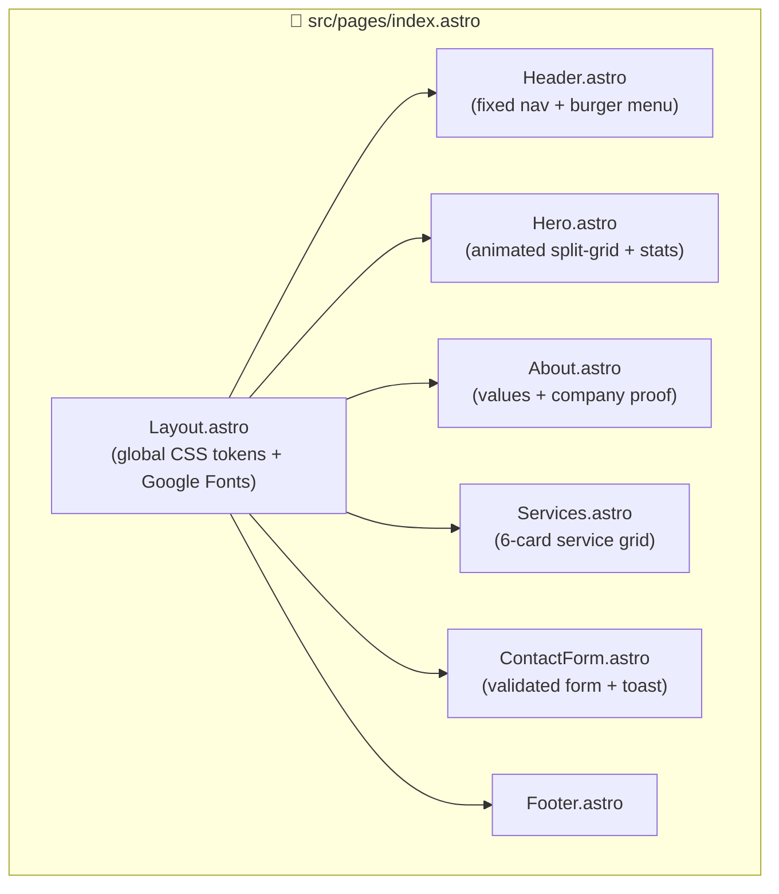
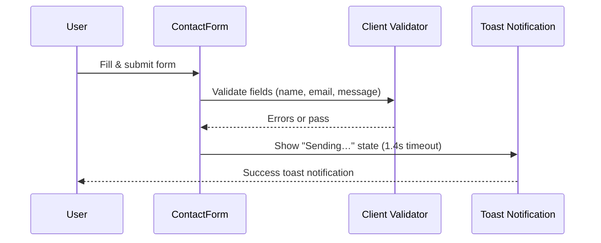

<div align="center">

# ITechSolutions

**Powering the Future with Smart IT Solutions**

A high-performance marketing landing page for ITechSolutions — delivering end-to-end technology services to 500+ businesses worldwide.

<br />

<p>
  <a href="#-getting-started">Get Started</a> •
  <a href="#-features">Features</a> •
  <a href="#-architecture">Architecture</a> •
  <a href="#-project-structure">Project Structure</a>
</p>

---

### Tech Stack


</div>

---

## ✨ Features

- **Fixed glassmorphism header** with scroll-blur effect and mobile burger menu
- **Animated hero section** — split-grid layout with a floating dashboard card, live metrics, and CSS blob animations
- **6-service grid** — Cloud Solutions, Custom Software, Cybersecurity, IT Consulting, Data & Analytics, Managed IT Services
- **About section** with company values and social proof stats (500+ clients, 12+ years, 99% uptime SLA)
- **Contact form** with client-side validation and toast notification feedback
- **Fully responsive** — mobile-first breakpoints at 580px and 900px
- **Zero JavaScript frameworks** — 100% vanilla JS in Astro `<script>` tags
- **Design token system** — CSS custom properties for colors, radii, shadows, and gradients
- **Single-page scroll navigation** via hash anchors (`#home`, `#about`, `#services`, `#contact`)

---

## 🏗️ Architecture



**Data flow — contact form:**



---

## 🛠️ Tech Stack

| Category | Technology |
|---|---|
| **Framework** | Astro 6.x (static + islands architecture) |
| **Language** | TypeScript (strict mode via `astro/tsconfigs/strict`) |
| **Styling** | Vanilla CSS with custom properties (no preprocessor) |
| **Fonts** | Inter (body) + Plus Jakarta Sans (headings) via Google Fonts |
| **Interactivity** | Vanilla JS in Astro `<script>` blocks |
| **Testing** | Playwright (installed, no test files yet) |
| **Runtime** | Node.js ≥ 22.12.0 |

---

## 📁 Project Structure

```
├── src/
│   ├── assets/               # SVG assets (logo, background)
│   ├── components/
│   │   ├── Header.astro      # Fixed nav — scroll-blur + mobile menu
│   │   ├── Hero.astro        # Animated split-grid hero + dashboard card
│   │   ├── About.astro       # Company values + stats
│   │   ├── Services.astro    # 6-card services grid
│   │   ├── ContactForm.astro # Client-validated form + toast
│   │   └── Footer.astro
│   ├── layouts/
│   │   └── Layout.astro      # HTML shell + global CSS design system
│   └── pages/
│       └── index.astro       # Single page — composes all components
├── public/                   # Static assets served as-is
├── CLAUDE.md                 # Claude Code project instructions
├── astro.config.mjs
├── tsconfig.json
└── package.json
```

---

## 🚀 Getting Started

### Prerequisites

- **Node.js** v22.12.0 or higher
- **npm** v10+

### Installation

```bash
# Clone the repository
git clone https://github.com/EbrahimHeggy/Astro-Framework.git
cd Astro-Framework

# Install dependencies
npm install

# Start the development server
npm run dev
```

Open [http://localhost:4321](http://localhost:4321) in your browser.

### Available Commands

| Command | Action |
|---|---|
| `npm run dev` | Start local dev server at `localhost:4321` |
| `npm run build` | Build production site to `./dist/` |
| `npm run preview` | Preview production build locally |

---

## 🎨 Design System

All design tokens are defined as CSS custom properties in `src/layouts/Layout.astro` and consumed via `var(--token)` in each component's scoped `<style>` block.

<details>
<summary>View all design tokens</summary>

| Token | Value | Usage |
|---|---|---|
| `--primary` | `#2563EB` | Buttons, links, accents |
| `--secondary` | `#7C3AED` | Gradient end, purple accents |
| `--gradient` | Blue → Purple 135° | CTAs, icon backgrounds |
| `--gradient-soft` | Light blue → light purple | Section backgrounds |
| `--dark` | `#0F172A` | Headings |
| `--muted` | `#64748B` | Body text, labels |
| `--border` | `#E2E8F0` | Card borders, dividers |
| `--surface` | `#F8FAFC` | Card backgrounds, inputs |
| `--radius-sm/md/lg/xl` | 8 / 12 / 20 / 28px | Border radii |
| `--shadow-sm/md/lg` | Layered box shadows | Elevation scale |

</details>

> [!NOTE]
> Do not add a CSS framework or preprocessor. All styling uses the existing token system and scoped component styles.

---

## 🧪 Testing

Playwright is installed as a dev dependency. No test files exist yet — tests can be added under a `tests/` directory.

```bash
# Run Playwright tests (once test files are added)
npx playwright test
```

---

## 📦 Deployment

This is a fully static Astro site with no server-side runtime. Deploy the `./dist/` output folder to any static host.

```bash
# Build for production
npm run build

# Preview the production build locally before deploying
npm run preview
```

**Compatible hosts:** Vercel, Netlify, Cloudflare Pages, GitHub Pages, AWS S3 + CloudFront.

---

## 🤝 Contributing

1. Fork the repository
2. Create a feature branch — `git checkout -b feat/your-feature`
3. Commit your changes — `git commit -m "feat: add your feature"`
4. Push to your branch — `git push origin feat/your-feature`
5. Open a Pull Request

> [!TIP]
> Keep components scoped. Add new styles inside the component's own `<style>` block and use existing design tokens — do not modify the global token definitions in `Layout.astro` unless adding a new system-wide token.

---

## 👤 Author

**Ebrahim Heggy** — [GitHub](https://github.com/EbrahimHeggy)

---

## 📄 License

This project is proprietary. All rights reserved by ITechSolutions.

---

<div align="center">
  Built with <a href="https://astro.build">Astro 6</a>
</div>
